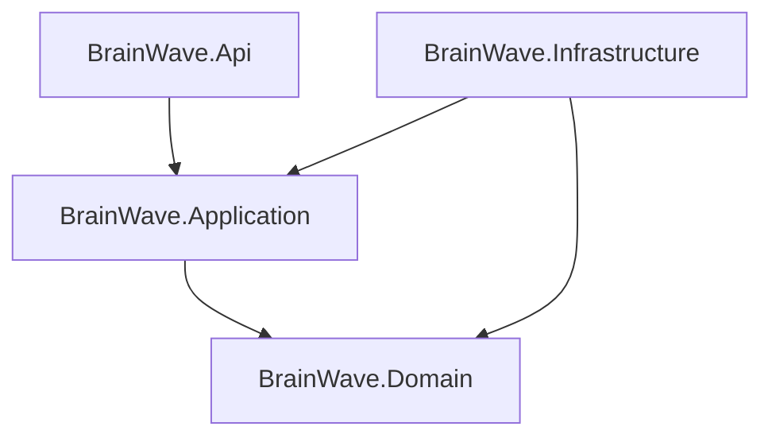

# 🚀 Tutoriel BrainWave Planner (Détaillé)

Ce guide est conçu pour vous aider à naviguer dans le projet **BrainWave Planner** et comprendre le rôle de chaque fichier important.

---

## 🏗️ 1. Architecture Globale (Clean Architecture)

Le projet suit les principes de la **Clean Architecture**. L'idée est de séparer les règles métier (le "quoi") de la technique (le "comment").



---

## 📁 2. Guide des Fichiers par Couche

### 🟢 BrainWave.Domain (Le Cœur)
C'est ici que résident les règles fondamentales. Ce projet ne dépend de rien d'autre.
*   **`Common/Entity.cs`** : La classe de base pour tous nos objets (ID unique, dates de création).
*   **`Entities/User.cs`** : Représente un utilisateur et son score de productivité.
*   **`Entities/TaskItem.cs`** : Une tâche concrète (titre, priorité, statut).
*   **`Entities/Objective.cs`** : Un objectif de haut niveau qui peut contenir plusieurs tâches.

### 🔵 BrainWave.Application (Le Cerveau)
Contient la logique de l'application (CQRS). C'est le "chef d'orchestre".
*   **`Common/Interfaces/IBrainWaveDbContext.cs`** : Un contrat qui définit ce que la base de données doit savoir faire, sans dire *comment* elle le fait.
*   **`Features/Tasks/Commands/CreateTask/`** :
    *   `CreateTaskCommand.cs` : Les données nécessaires pour créer une tâche.
    *   `CreateTaskCommandHandler.cs` : **Le fichier le plus important.** Il contient la logique (Vérifier l'utilisateur, créer la tâche, enregistrer).
*   **`Features/Scoring/`** : Contient les algorithmes de calcul du score de productivité.

### 🟡 BrainWave.Infrastructure (Les Outils)
Gère les détails techniques comme la base de données.
*   **`Persistence/BrainWaveDbContext.cs`** : L'implémentation réelle de la base de données avec Entity Framework Core.
*   **`Persistence/Migrations/`** : Historique des changements de la base de données (généré automatiquement).

### 🔴 BrainWave.Api (La Porte d'Entrée)
Expose les services au monde extérieur (Web).
*   **`Program.cs`** : Le point de démarrage. Configure Scalar, la base de données et les redirections.
*   **`Controllers/TasksController.cs`** : Définit les URLs pour gérer les tâches (ex: `POST /api/Tasks`).
*   **`appsettings.json`** : Contient la "Connection String" pour se connecter à PostgreSQL.

---

## 🚀 3. Commandes Utiles

| Commande | Utilité |
| :--- | :--- |
| `dotnet build` | Vérifie que le code n'a pas d'erreurs. |
| `dotnet run --project src/BrainWave.Api` | Lance le serveur. |
| `docker-compose up -d` | Démarre la base de données PostgreSQL. |
| `dotnet ef database update` | Met à jour le schéma de la base de données. |

---

## 🔍 4. Tester avec l'interface Scalar

1.  Lancez le projet.
2.  Allez sur [http://localhost:5200/scalar/v1](http://localhost:5200/scalar/v1).
3.  Utilisez les JSON d'exemples fournis dans l'interface pour créer des tâches et voir votre score de productivité évoluer !

---

## 🚀 5. Déploiement (Mise en ligne)

Le projet est prêt à être déployé sur des plateformes comme **Render**, **Railway** ou **Koyeb**.

### A. Docker
Un `Dockerfile` est présent à la racine. Pour construire l'image localement :
```bash
docker build -t brainwave-api .
```

### B. Configuration Base de Données
En production, l'application appliquera **automatiquement** les migrations au démarrage. Vous devez simplement fournir la chaîne de connexion via une variable d'environnement :
*   **Variable** : `ConnectionStrings__DefaultConnection`
*   **Valeur** : `Host=votreSql;Database=db;Username=user;Password=pass`

### C. Étapes de déploiement (ex: Render)
1. Créez un nouveau **Web Service** sur Render.
2. Connectez votre dépôt GitHub.
3. Choisissez **Docker** comme environnement.
4. Ajoutez la variable d'environnement `ConnectionStrings__DefaultConnection`.
5. Validez ! Votre API sera en ligne en quelques minutes.

---

*Note : Pour toute modification du code, n'oubliez pas de redémarrer le serveur avec `dotnet run`.*
